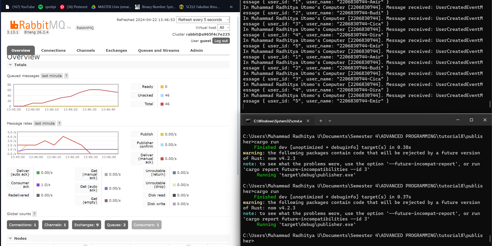

a. What is amqp?
AMQP (Advanced Message Queuing Protocol) is an open standard applicationlayer protocol for message -oriented middleware. It enables messaging between applications, it has features such as message queueing, routing, and acknowledgement. Messages are exchanged between producers and consumers via brokers, which route them through exchanges to appropriate queues. Used in conjunction with RUST, it can be used to implement an efficient messaging system like event, request, or command without needing a receiver connected directly with the sender. In turn this enables AQMP in RUST to have messaging or data trading between programs on different systems.

b. What it means? guest:guest@localhost:5672 , what is the first guest, and what is the second guest, and what is localhost:5672 is for?
`guest:guest@localhost:5672` : `guest:guest` is the username and password used for authentication when connecting to the AMQP broker, `<username>:<password>`. The current "guest" values are usually used for testing and development purposes and should be changed post production. 
`localhost:5672` is the specified address and port number of the AMQP broker. It uses the local machine (localhost), meaning the broker is running on the same computer as the client application. "5672" is the default port number for AMQP communication. If the broker is running on a different machine or a different port is used, it would be reflected here. 

 
 

Cargo running publisher multiple times with sleep (Slow Subscriber)

The total number of queues are 51, peaking at a about 60 total queues. This is counting messages on hold due the influx of request from publisher being spammed, but subscriber can only process the messages one-by-one thus causing the high queue count. This also increases the prefetch count and adding more tasks for subscriber to handle, in essence it created a long line of requests.

 

